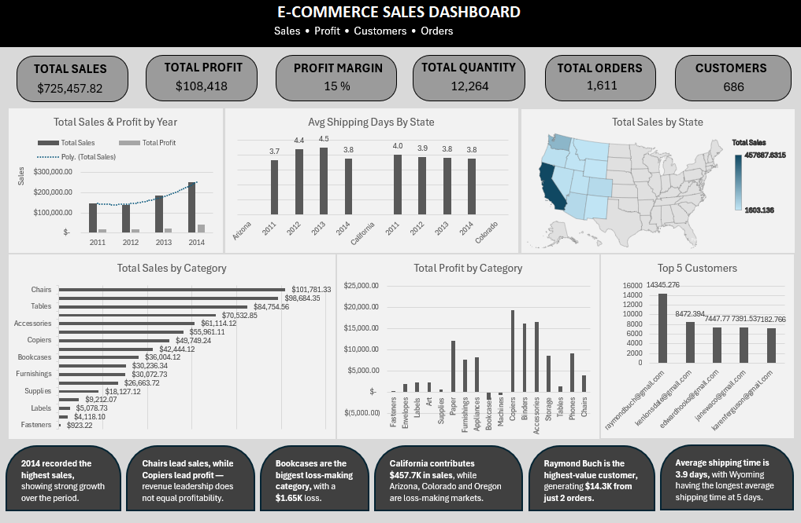

# 📊 E-Commerce Sales & Profit Analysis Dashboard

An end-to-end Excel analytics project that turns raw order data into a business dashboard. It shows **where the money is made, where it is lost, and how fast orders are delivered**.

**Built with:** Microsoft Excel · Power Query · Power Pivot (Data Model) · DAX · PivotTables · Excel charts

---

## 🧭 Project overview

An online store sells office products (chairs, phones, binders and more) to customers in 11 US states. The business wants to know:

- Are sales and profit growing?
- Which products and states earn money, and which lose it?
- Who are the best customers?
- How quickly do orders ship?

This project answers those questions with a clean dataset, a Data Model with DAX measures, four analysis sheets and one dashboard.

> **Simple picture of the workflow:** raw data is like groceries. Power Query washes and chops them, the Data Model and DAX are the recipe, PivotTables are the cooked dishes, and the dashboard is the plated meal.

---

## 📈 Headline numbers

| KPI | Value |
|---|---|
| Total sales | **$725,457.82** |
| Total profit | **$108,418.45** |
| Profit margin | **14.94%** |
| Total orders | **1,611** |
| Customers | **686** |
| Units sold | 12,264 |
| Average order value | about $450 |
| Average shipping time | **3.9 days** |
| Period covered | Jan 2011 – Dec 2014 |

---

## 🗂️ What is in the workbook

| Sheet | Purpose |
|---|---|
| `E-commerce` | Cleaned data: 3,203 rows × 20 columns (one row per product in an order) |
| `product Analysis` | Sales and profit by year, category and state, plus a Colorado loss drill-down |
| `Customer Analysis` | Sales, profit, orders and quantity for each of the 686 customers |
| `Shipping Analysis` | Average shipping days by category and by state |
| `Dashboard` | One-page summary: 6 KPI cards, 6 charts and 6 insight call-outs |

The workbook has **8 PivotTables** connected to one Data Model table, with **8 DAX measures**.

Full column and measure explanations are in [`DATA_DICTIONARY.md`](DATA_DICTIONARY.md).

---

## 🔧 How the project was done

### 1. Data cleaning and transformation (Power Query)
- Promoted headers and corrected data types (text, dates, currency, whole numbers)
- Fixed the swapped `city` and `state` labels
- Converted dates using the English (India) locale so day and month are read correctly
- Calculated **Shipping Days** (ship date minus order date)
- Built date fields: Order Year, Month, Month No. and Year-Month
- Created **Unit Selling Price** and **Profit Margin**
- Lowercased customer emails so one customer is never counted twice

### 2. Data analysis (PivotTables, Power Pivot, DAX)
- Loaded the clean table into the Data Model
- Wrote DAX measures: Total Sales, Total Profit, Profit_Margin, Total Quantity, Distinct Orders, Distinct Customers, Avg Shipping Days, Average Order Value
- Analysed sales and profit by year, category, state, customer and shipping time

### 3. Dashboard
- 6 KPI cards: Total Sales, Total Profit, Profit Margin, Total Quantity, Total Orders, Customers
- Total Sales & Profit by Year (with a trend line for sales)
- Average Shipping Days by State
- Total Sales by State (map)
- Total Sales by Category
- Total Profit by Category
- Top 5 Customers
- 6 insight call-outs along the bottom that summarise the main findings



*Dashboard preview: 6 KPI cards, 6 charts and 6 key-insight call-outs.*

---

## 💡 Key business insights

1. **Strong growth.** Sales rose from $147.9K (2011) to **$250.6K (2014)**, which is the highest year. 2014 sales were about 34% above 2013. The only dip was 2012 (about −5% versus 2011). Profit margin also peaked in 2014 at 17.5%.

2. **High sales does not mean high profit.**
   - **Chairs** had the highest sales ($101.8K) but earned only $4.0K profit (about 4% margin).
   - **Copiers** earned the highest profit ($19.3K) from just $49.7K of sales (about 39% margin).
   - **Tables** sold $84.8K but made only $1.5K profit.

3. **Loss-making categories.** **Bookcases** lost the most (−$1,646.51 on $36.0K of sales). **Machines** also lost money (−$618.93). Pricing, discounts and costs for both need review.

4. **Sales depend heavily on California.** California brought in $457.7K, about **63%** of all sales, followed by Washington ($138.6K).

5. **Three states lose money:** **Colorado (−$6,527.86)**, **Arizona (−$3,427.92)** and **Oregon (−$1,190.47)**. In Colorado, Machines are the main problem (−$4,384.26), led by one Lexmark laser printer that lost $3,399.98 on 5 units.

6. **Top customer:** `raymondbuch@gmail.com` (Raymond Buch) spent **$14.3K in only 2 orders**, the highest of all customers. Frequent buyers such as `kenlonsdale@gmail.com` ($8.5K over 5 orders) show a different kind of loyalty.

7. **Shipping is steady.** The average is **3.9 days**. By category, Copiers are fastest (3.2 days) and Appliances slowest (4.1 days). By state, Colorado is fastest (3.7 days) and Montana, New Mexico and Nevada are slower (4.4 to 4.6 days). Wyoming shows 5.0 days, but it has only 1 order, so treat it with care.

---

## ✅ Skills shown

- Data cleaning and transformation with **Power Query**
- Data modelling with **Power Pivot**
- Business calculations with **DAX measures**
- Summarising data with **PivotTables**
- **Dashboard design** and data visualisation
- Turning numbers into **business recommendations**

---

## ⚠️ Limitations

- Only 4 years of data (2011–2014) and 11 US states
- Customers are identified by email only (no names, ages or segments)
- `Category` holds 17 product types with no higher-level grouping
- Profit comes from the source data, so there is no breakdown of discounts or costs
- Small groups (such as Wyoming with 1 order) can give misleading averages

---

## ▶️ How to open and use

1. Open `e_commerce_analysis.xlsx` in Microsoft Excel (desktop version, because the Data Model and Power Pivot are needed).
2. Go to the `Dashboard` sheet for the summary.
3. Explore the other sheets for detail.
4. To refresh the data, the Power Query connection must point to the original `ecommerce.xlsx` file. Update the path in **Data > Queries & Connections > Edit > Source** if the file has moved.

---

## 📁 Suggested repository layout

```
├── e_commerce_analysis.xlsx
├── README.md
├── DATA_DICTIONARY.md
└── images/
    └── dashboard.png
```

---

## 👤 Author

**Jyoti** — Data Analyst
🔗 LinkedIn: *add your link*  ·  💻 GitHub: *add your link*

`#DataAnalytics` `#Excel` `#PowerQuery` `#PowerPivot` `#DAX` `#DataVisualization` `#Dashboard` `#BusinessIntelligence`
